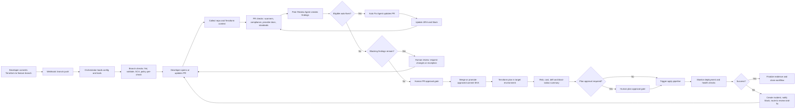

# Agentic AI DevOps System for Terraform Deployment

## 1. Purpose

This document defines a technical and system specification for an agentic AI platform that reviews, fixes, governs, deploys, and monitors Terraform infrastructure-as-code changes. The proposed implementation uses LangGraph as the orchestration framework, MCP servers as the preferred tool integration layer, and either OpenAI or Anthropic models as configurable LLM providers.

The design is intentionally configuration-driven. The core workflow is configured through `config.json`; each tool integration is configured independently through a `<tool-name>.json` file, such as `github.json`, `jira.json`, `slack.json`, `confluence.json`, and `terraform.json`. Secrets are never embedded in configuration or code; they are referenced through environment variables or an enterprise secrets manager.

## 2. Diagram Understanding and DevOps Validation

The attached flow describes a PR-centered Terraform deployment lifecycle:

1. Developers write Terraform locally.
2. Developers commit to feature branches in GitHub.
3. On branch push, static code analysis and compliance checks run.
4. Developers create a pull request to merge changes into the main branch.
5. On PR, a review-and-fix loop starts.
6. A peer review agent inspects the code and creates structured findings with severity and confidence scores.
7. An auto-fix agent remediates eligible findings and updates the same PR.
8. A JIRA/ITSM agent records findings, remediation details, severity, and confidence.
9. The review-and-fix loop ends when no eligible issues remain.
10. A human approves the PR after reviewing agent output and changes.
11. A deployment pipeline applies Terraform to the target environment.
12. A monitor agent observes the deployment and opens incidents if failures occur.
13. Slack is used as the communication layer for notifications and links.

The flow is directionally correct for an AI-assisted DevOps process, but it should be hardened before implementation.

## 3. Recommended Flow Improvements

### 3.1 Add Explicit Terraform Stages

The diagram jumps from approval to initiating the deployment pipeline. For Terraform, the workflow should explicitly separate:

- `terraform fmt` and style validation.
- `terraform init` with controlled backend/provider configuration.
- `terraform validate`.
- static IaC scanning.
- policy evaluation.
- `terraform plan`.
- human review of the plan artifact.
- `terraform apply`.

The `plan` output must be treated as a first-class review artifact. Human approval should be based not only on code diff and agent comments, but also on the actual planned infrastructure changes.

### 3.2 Add a Plan Approval Gate Before Apply

There should be two human gates:

- PR merge approval: validates code quality, policy compliance, and auto-fix results.
- Apply approval: validates the Terraform plan for the target environment.

For low-risk non-production environments, apply approval may be configurable as optional. For production, it should be mandatory.

### 3.3 Do Not Let the LLM Directly Apply Infrastructure

The LLM should reason, summarize, classify, and propose actions. The actual apply operation should be performed by the CI/CD system or Terraform platform using fixed service identities, policy checks, audit logs, and environment protection rules. The agent may trigger or monitor the pipeline through approved tools, but it should not hold broad cloud-admin credentials.

### 3.4 Add Policy-as-Code and Drift Detection

The compliance agent should not rely only on Confluence policy text. It should combine:

- Confluence knowledge retrieval for human-readable standards.
- executable policy engines such as OPA/Conftest, Sentinel, Checkov, tfsec, Terrascan, or cloud-native policy tools.
- drift detection for already-deployed environments.

The agent can explain violations and suggest fixes, but deterministic policy engines should remain authoritative for pass/fail decisions.

### 3.5 Add Blast Radius and Cost/Risk Analysis

Before approval, the system should summarize:

- resources to create, update, replace, or destroy.
- security-sensitive changes such as public ingress, IAM policy expansion, secret exposure, disabled encryption, or logging changes.
- estimated cost impact where tooling is available.
- environment risk level.
- rollback or recovery notes.

### 3.6 Add Loop Limits and Escalation Rules

The review-and-fix loop should have configured limits:

- maximum auto-fix iterations.
- maximum files changed by auto-fix.
- allowed severity/confidence thresholds.
- disallowed fix categories.
- escalation when fixes are risky, repeated, or uncertain.

### 3.7 Add Audit and Evidence Collection

Every run should produce an immutable evidence bundle:

- PR URL and commit SHAs.
- scan results.
- policy results.
- agent findings.
- auto-fix patch summary.
- JIRA links.
- Slack thread link.
- Terraform plan summary and plan artifact reference.
- human approval identity and timestamp.
- pipeline run IDs.
- apply result.
- monitor result.

## 4. Target Architecture

### 4.1 Logical Components

| Component | Responsibility |
|---|---|
| LangGraph Orchestrator | Owns workflow state, routing, branching, retries, persistence, human interrupts, and node execution order. |
| Agent Runtime API | Receives GitHub webhooks, pipeline callbacks, manual approval decisions, and monitoring events. |
| Agent Workers | Execute LangGraph nodes and long-running tasks. |
| MCP Client Layer | Loads configured MCP servers and exposes approved tools to agents. |
| Tool Config Registry | Reads `config.json` and `<tool-name>.json` files; validates schemas and allowed capabilities. |
| LLM Provider Adapter | Selects OpenAI or Anthropic models based on configuration. |
| State Store | Persists workflow state, PR metadata, findings, approvals, and run status. |
| Checkpointer | Persists LangGraph execution checkpoints so workflows can pause and resume. |
| Evidence Store | Stores scan reports, plan summaries, generated review reports, and audit artifacts. |
| Observability Stack | Captures traces, logs, metrics, tool calls, decisions, and failures. |

### 4.2 Recommended Deployment Topology

For enterprise use, deploy the system as a service, not as a developer-local assistant:

- API service behind an internal gateway.
- worker service for LangGraph execution.
- PostgreSQL for LangGraph checkpointing and workflow metadata.
- object storage for artifacts and evidence.
- secrets manager for tokens and keys.
- CI/CD runner with least-privilege Terraform execution identity.
- private networking to enterprise GitHub, Jira, Confluence, Slack, and Terraform services where applicable.

## 5. Agent Roles

### 5.1 Orchestrator Agent

The orchestrator is the only agent that decides workflow routing. It does not perform detailed tool work itself. It reads state, evaluates gates, and delegates to specialized nodes.

Responsibilities:

- load workflow and tool configuration.
- initialize MCP clients.
- select the correct LLM provider/model.
- route by event type: branch push, PR opened, PR updated, approval, pipeline event, monitor event.
- enforce loop limits.
- pause for human approval.
- record state transitions.
- publish high-level status.

### 5.2 Repository Context Agent

Responsibilities:

- inspect PR diff and repository structure.
- identify Terraform modules, environments, providers, backends, and changed resources.
- collect related README, module documentation, previous issues, and ownership metadata.
- classify change type: module change, environment change, provider upgrade, state/backend change, policy change, or pipeline change.

Primary tools:

- GitHub MCP server.
- filesystem or repository MCP if available.

### 5.3 SCA and IaC Security Agent

Responsibilities:

- run or collect static analysis results.
- identify vulnerable modules/providers.
- enforce Terraform formatting and style.
- identify insecure defaults and risky resources.

Primary tools:

- GitHub MCP.
- Terraform MCP for current provider/module documentation.
- scanner tools exposed through custom MCP servers or CI artifacts.

### 5.4 Compliance and Policy Agent

Responsibilities:

- retrieve applicable standards from Confluence.
- map policy text to executable checks where possible.
- evaluate CIS, tagging, network, encryption, logging, IAM, SLA, and operating procedure requirements.
- produce deterministic pass/fail status when policy tools are available.

Primary tools:

- Atlassian/Confluence MCP.
- policy scanner MCP.
- Terraform MCP.

### 5.5 Peer Review Agent

Responsibilities:

- review code diffs and scan outputs.
- produce findings with file path, line reference, severity, confidence, rationale, and fix recommendation.
- avoid duplicating deterministic scanner findings unless adding useful explanation.
- classify each finding as `auto_fix_allowed`, `human_required`, or `informational`.

Severity values:

- `HIGH`: may cause security, availability, compliance, cost, data loss, or production impact.
- `MEDIUM`: meaningful risk or maintainability issue but not immediately critical.
- `LOW`: style, convention, minor maintainability, or weak signal.

Confidence values:

- number between `0.0` and `1.0`.
- auto-fix should be allowed only when confidence and severity policy allow it.

### 5.6 Auto Fix Agent

Responsibilities:

- apply narrowly scoped code fixes for eligible findings.
- avoid broad refactors.
- run formatting and validation after changes.
- update the same PR.
- produce a patch summary and unresolved item report.

Recommended default policy:

- Auto-fix `HIGH` only when confidence is at least `0.85` and the fix is deterministic.
- Auto-fix `MEDIUM` when confidence is at least `0.70`.
- Auto-fix `LOW` when confidence is at least `0.60`.
- Never auto-fix backend migration, state manipulation, destructive resource changes, IAM privilege expansion, production networking exposure, or provider major upgrades without human approval.

### 5.7 ITSM Agent

Responsibilities:

- create or update JIRA issues for review findings, failures, and exceptions.
- attach links to PRs, pipeline runs, plan artifacts, and Slack threads.
- update issue status as the workflow progresses.
- preserve severity, confidence, affected environment, and owner.

Primary tools:

- Atlassian/Jira MCP.

### 5.8 Human Approval Agent

This is not an autonomous approver. It packages the decision context and pauses the workflow.

Responsibilities:

- present PR approval request.
- present plan approval request.
- collect `approve`, `reject`, `request_changes`, or `defer` decisions.
- record identity, timestamp, comment, and scope of approval.

### 5.9 Deployment Agent

Responsibilities:

- trigger GitHub Actions, Terraform Cloud/HCP Terraform, Terraform Enterprise, or another deployment pipeline.
- pass only approved commit SHA and target environment.
- monitor pipeline status.
- collect plan/apply outputs.

The deployment agent should not perform raw cloud operations from the LLM runtime.

### 5.10 Monitor Agent

Responsibilities:

- watch post-apply pipeline status.
- observe Terraform run result and health checks.
- detect drift or failed deployment.
- create incidents and route back to the review-and-fix loop when needed.

### 5.11 Communication Agent

Responsibilities:

- post concise Slack updates.
- maintain a Slack thread per workflow run.
- include links to PR, plan, JIRA, pipeline, and evidence bundle.
- request human action when approval is blocked.

## 6. Recommended LangGraph Workflow

### 6.1 Workflow State

The LangGraph state should be strongly typed. A representative state object:

```json
{
  "run_id": "uuid",
  "event_type": "branch_push | pr_opened | pr_updated | approval_received | pipeline_event | monitor_event",
  "repository": {
    "owner": "string",
    "name": "string",
    "default_branch": "main"
  },
  "pull_request": {
    "number": 123,
    "url": "string",
    "source_branch": "feature/example",
    "target_branch": "main",
    "head_sha": "string"
  },
  "environment": {
    "name": "dev | test | stage | prod",
    "risk_level": "low | medium | high"
  },
  "changed_files": [],
  "terraform_context": {
    "modules": [],
    "providers": [],
    "workspaces": [],
    "backend_changed": false
  },
  "findings": [],
  "auto_fix_iterations": 0,
  "policy_results": [],
  "plan_summary": {},
  "approvals": [],
  "jira_issues": [],
  "slack_thread": {},
  "pipeline_runs": [],
  "evidence": [],
  "status": "running | waiting_for_human | failed | completed"
}
```

### 6.2 Graph Nodes

| Node | Input | Output | Notes |
|---|---|---|---|
| `load_config` | run request | validated config | Fails closed if config invalid. |
| `initialize_tools` | config | MCP tool registry | Loads enabled tool JSON files only. |
| `route_event` | event | next node | Branch push, PR, approval, pipeline, monitor. |
| `collect_repo_context` | PR/branch metadata | changed files and Terraform context | Uses GitHub MCP. |
| `run_branch_checks` | branch push | SCA/compliance summary | Early feedback before PR. |
| `run_pr_checks` | PR metadata | scanner and policy reports | Required for PR flow. |
| `peer_review` | diff and reports | findings | LLM-assisted, schema-validated. |
| `classify_findings` | findings | fix plan | Applies deterministic thresholds. |
| `auto_fix` | fix plan | commit or patch summary | Limited to approved categories. |
| `update_itsm` | findings/status | JIRA updates | Idempotent create/update. |
| `review_loop_gate` | findings/fix attempts | next step | Continue loop, wait human, or fail. |
| `request_pr_approval` | report | interrupt | Human decision gate. |
| `merge_or_wait` | approval | merge/pipeline decision | May use branch protection instead of direct merge. |
| `generate_plan` | approved SHA/env | plan artifact | CI/CD or Terraform platform executes. |
| `request_plan_approval` | plan summary | interrupt | Mandatory for production. |
| `trigger_apply` | approved plan | pipeline run | CI/CD executes apply. |
| `monitor_deployment` | run IDs | health status | Polls or receives callbacks. |
| `finalize_evidence` | all artifacts | evidence bundle | Stored and linked. |
| `notify` | state update | Slack message | Called at significant transitions. |

### 6.3 Updated Workflow Diagram



## 7. Configuration-Driven Design

### 7.1 Configuration Principles

- `config.json` defines global workflow behavior and references tool config files.
- Each tool has its own `<tool-name>.json`.
- Tool configs declare connection details, allowed capabilities, approval policy, and environment variable names for credentials.
- LLM provider and model settings are configurable.
- MCP server transport, URL/command, tool allowlists, and auth strategy are configurable.
- Configuration is schema-validated during startup.
- Invalid or missing config fails closed.
- Tool-specific changes do not require code changes or edits to other tool configs.

### 7.2 Example `config.json`

```json
{
  "version": "1.0",
  "workflow": {
    "name": "terraform-agentic-devops",
    "default_environment": "dev",
    "max_auto_fix_iterations": 3,
    "require_pr_approval": true,
    "require_plan_approval": {
      "dev": false,
      "test": true,
      "stage": true,
      "prod": true
    },
    "allowed_target_branches": ["main"],
    "evidence_retention_days": 365
  },
  "llm": {
    "provider": "openai",
    "model": "gpt-5.4",
    "temperature": 0.1,
    "max_output_tokens": 6000,
    "api_key_env": "OPENAI_API_KEY",
    "fallback": {
      "provider": "anthropic",
      "model": "claude-sonnet-4-6",
      "api_key_env": "ANTHROPIC_API_KEY"
    }
  },
  "state": {
    "checkpointer": {
      "type": "postgres",
      "connection_string_env": "LANGGRAPH_POSTGRES_URL"
    },
    "artifact_store": {
      "type": "s3",
      "bucket_env": "EVIDENCE_BUCKET",
      "kms_key_env": "EVIDENCE_KMS_KEY_ID"
    }
  },
  "tools": {
    "github": {
      "enabled": true,
      "config_file": "tools/github.json"
    },
    "jira": {
      "enabled": true,
      "config_file": "tools/jira.json"
    },
    "confluence": {
      "enabled": true,
      "config_file": "tools/confluence.json"
    },
    "slack": {
      "enabled": true,
      "config_file": "tools/slack.json"
    },
    "terraform": {
      "enabled": true,
      "config_file": "tools/terraform.json"
    },
    "iac_scanner": {
      "enabled": true,
      "config_file": "tools/iac_scanner.json"
    }
  },
  "risk_policy": {
    "auto_fix": {
      "HIGH": 0.85,
      "MEDIUM": 0.70,
      "LOW": 0.60
    },
    "never_auto_fix_categories": [
      "terraform_backend_change",
      "state_migration",
      "resource_destroy",
      "iam_privilege_expansion",
      "public_network_exposure",
      "provider_major_upgrade",
      "production_database_change"
    ],
    "block_merge_on": ["HIGH"],
    "block_apply_on": ["HIGH", "unapproved_destroy"]
  },
  "notifications": {
    "default_channel": "#terraform-deployments",
    "approval_channel": "#terraform-approvals",
    "incident_channel": "#platform-incidents"
  }
}
```

### 7.3 Example `tools/github.json`

```json
{
  "name": "github",
  "type": "mcp",
  "server": {
    "transport": "streamable_http",
    "url": "https://api.githubcopilot.com/mcp/",
    "auth": {
      "type": "bearer",
      "token_env": "GITHUB_MCP_TOKEN"
    }
  },
  "repositories": [
    {
      "owner": "example-org",
      "name": "terraform-infra",
      "allowed_branches": ["main"],
      "protected_branches": ["main"]
    }
  ],
  "allowed_tools": [
    "repos.get",
    "pull_requests.get",
    "pull_requests.list_files",
    "pull_requests.create_review_comment",
    "pull_requests.update_branch",
    "issues.create",
    "actions.list_workflow_runs",
    "actions.rerun_workflow"
  ],
  "approval_policy": {
    "write_operations": "human_or_policy_approved",
    "merge_operations": "external_branch_protection"
  }
}
```

### 7.4 Example `tools/terraform.json`

```json
{
  "name": "terraform",
  "type": "mcp",
  "server": {
    "transport": "stdio",
    "command": "terraform-mcp-server",
    "args": [],
    "env": {
      "TFE_TOKEN": "TFE_TOKEN"
    }
  },
  "mode": "advisory_and_metadata",
  "allowed_tools": [
    "registry.search_providers",
    "registry.get_provider_docs",
    "registry.search_modules",
    "hcp_terraform.list_workspaces",
    "hcp_terraform.get_workspace"
  ],
  "disallowed_tools": [
    "hcp_terraform.delete_workspace",
    "hcp_terraform.update_workspace_variables"
  ],
  "execution_policy": {
    "plan": "ci_cd_only",
    "apply": "ci_cd_only",
    "destroy": "disabled"
  }
}
```

### 7.5 Example `tools/jira.json`

```json
{
  "name": "jira",
  "type": "mcp",
  "server": {
    "transport": "streamable_http",
    "url": "https://mcp.atlassian.com/v1/mcp/authv2",
    "auth": {
      "type": "oauth2_or_token",
      "token_env": "ATLASSIAN_MCP_TOKEN"
    }
  },
  "project_key": "DEVOPS",
  "issue_type": "Incident",
  "allowed_tools": [
    "jira.search",
    "jira.create_issue",
    "jira.update_issue",
    "jira.add_comment"
  ],
  "field_mapping": {
    "severity": "customfield_severity",
    "confidence": "customfield_confidence",
    "environment": "customfield_environment",
    "run_id": "customfield_agent_run_id"
  }
}
```

### 7.6 Example `tools/slack.json`

```json
{
  "name": "slack",
  "type": "mcp",
  "server": {
    "transport": "streamable_http",
    "url": "https://slack.com/mcp",
    "auth": {
      "type": "oauth2",
      "token_env": "SLACK_MCP_TOKEN"
    }
  },
  "channels": {
    "default": "#terraform-deployments",
    "approvals": "#terraform-approvals",
    "incidents": "#platform-incidents"
  },
  "allowed_tools": [
    "search",
    "send_message",
    "read_thread",
    "create_canvas",
    "update_canvas"
  ],
  "message_policy": {
    "include_sensitive_values": false,
    "thread_per_run": true
  }
}
```

## 8. MCP Integration Design

MCP should be treated as the tool boundary between agents and enterprise systems. The core system should not call GitHub, Jira, Slack, Confluence, or Terraform APIs directly unless an MCP server is unavailable and a deliberate adapter exception is approved.

### 8.1 MCP Client Responsibilities

- read enabled tool configs.
- initialize each MCP server connection.
- list available tools.
- compare discovered tools against configured allowlists.
- block unknown or disallowed tools.
- inject auth headers or environment variables without exposing secret values to the LLM.
- normalize tool responses into typed artifacts.
- record every tool call for audit.

### 8.2 Tool Risk Levels

Every MCP tool should be classified:

| Risk | Examples | Approval Requirement |
|---|---|---|
| `read` | list PR files, read Confluence page, search Slack | no human approval, but audit required |
| `comment` | add PR comment, add JIRA comment, post Slack update | policy approval |
| `write` | update PR branch, create JIRA issue, update Confluence page | policy or human approval |
| `execute` | trigger pipeline, rerun workflow, initiate plan | human/policy approval |
| `destructive` | delete workspace, destroy resources, modify state | disabled or break-glass only |

### 8.3 Tool Isolation

Each tool config must be loaded into a separate logical namespace:

- `github.*`
- `jira.*`
- `confluence.*`
- `slack.*`
- `terraform.*`
- `iac_scanner.*`

Agents receive only the tools required for their role. For example, the Communication Agent does not receive Terraform tools, and the Compliance Agent does not receive Slack write tools unless explicitly configured.

## 9. LLM Provider Design

The model provider is selected from configuration. Both OpenAI and Anthropic should be supported through a provider adapter interface:

```text
LLMProvider
  - generate_structured_output(schema, prompt, context)
  - summarize(context)
  - classify_findings(findings, policy)
  - propose_fix(diff, finding, constraints)
```

Implementation requirements:

- use structured output schemas for findings, fix plans, approval summaries, and risk reports.
- keep temperature low for review and remediation tasks.
- use model-specific prompt templates only behind the adapter.
- allow per-agent model overrides where needed.
- never pass secrets to the model.
- redact provider tokens, cloud credentials, Terraform variables, and state content.

## 10. Secrets and Identity

Secrets must be stored outside code and config. The config may reference environment variable names, not values.

Recommended environment variables:

```text
OPENAI_API_KEY
ANTHROPIC_API_KEY
GITHUB_MCP_TOKEN
ATLASSIAN_MCP_TOKEN
SLACK_MCP_TOKEN
TFE_TOKEN
LANGGRAPH_POSTGRES_URL
EVIDENCE_BUCKET
EVIDENCE_KMS_KEY_ID
```

Production recommendation:

- source environment variables from a secrets manager such as HashiCorp Vault, AWS Secrets Manager, Azure Key Vault, or Google Secret Manager.
- use workload identity or OIDC where possible.
- use short-lived tokens.
- enforce least privilege per tool.
- rotate credentials regularly.
- separate identities by environment.
- do not share the Terraform apply identity with the agent runtime identity.

## 11. Approval and Governance Model

### 11.1 Approval Types

| Approval | Trigger | Approver |
|---|---|---|
| Auto-fix approval | Risky or uncertain fix | Code owner or platform engineer |
| PR approval | No blocking findings remain | Code owner or reviewer |
| Exception approval | Policy violation accepted temporarily | Security/compliance owner |
| Plan approval | Terraform plan ready | Environment owner |
| Break-glass approval | Emergency production fix | Senior approver group |

### 11.2 LangGraph Human Interrupts

LangGraph should pause at approval points using interrupts and resume with a structured decision:

```json
{
  "decision": "approve",
  "approver": "user@example.com",
  "comment": "Approved for staging apply",
  "scope": "terraform_plan",
  "expires_at": "2026-05-15T23:59:59Z"
}
```

Valid decisions:

- `approve`
- `reject`
- `request_changes`
- `defer`
- `approve_with_exception`

## 12. Terraform Deployment Design

### 12.1 Recommended CI/CD Contract

The agentic system should interact with CI/CD through a narrow contract:

- input: repository, commit SHA, environment, workflow name.
- output: run ID, status, logs URL, plan artifact URL, apply result.
- allowed actions: trigger plan, trigger apply after approval, monitor run, rerun failed safe jobs.

### 12.2 Terraform Plan Requirements

The plan stage must capture:

- resource create/update/replace/delete counts.
- detailed destructive changes.
- IAM/security/network changes.
- data sources and external dependencies.
- provider version changes.
- module version changes.
- backend/state changes.
- policy results.
- cost estimate when available.

### 12.3 Apply Requirements

Apply must require:

- approved commit SHA.
- approved plan artifact or plan ID.
- target environment.
- service identity with least privilege.
- locked state.
- environment protection rules.
- audit log.

For production, the apply should be impossible unless the plan approval and PR approval are both recorded in workflow state.

## 13. Monitoring and Incident Handling

The monitor agent should observe:

- GitHub Actions or deployment pipeline status.
- Terraform/HCP Terraform run status.
- post-deployment smoke tests.
- cloud service health checks.
- drift detection results.
- alert manager events.

On failure:

1. Create or update JIRA incident.
2. Post Slack incident notification.
3. Attach pipeline logs and Terraform output.
4. Classify failure as code issue, environment issue, policy issue, quota issue, provider issue, or transient issue.
5. Route back to PR review-and-fix when code change is needed.
6. Escalate to human when rollback or state recovery is required.

## 14. Security Controls

Required controls:

- tool allowlists per agent.
- explicit approval for write, execute, and destructive tools.
- no direct LLM access to secrets.
- no raw Terraform state in prompts unless redacted.
- prompt-injection filtering for repository, Confluence, PR, and issue content.
- scan generated patches before commit.
- verify auto-fix only changes expected files.
- sign commits or use a bot identity with branch protection.
- preserve audit trail for every tool call.
- isolate non-production and production credentials.
- enforce branch protection and environment protection outside the agent.
- maintain denylist for unsafe tool calls.
- rate-limit and circuit-break repeated failures.

MCP security note: MCP tools can expose powerful actions, so the host must implement consent, authorization, tool review UI, and tool allowlisting. Tool descriptions and retrieved content should be treated as untrusted unless from approved servers.

## 15. Observability

Capture these telemetry events:

- workflow started/completed/failed.
- node started/completed/failed.
- LLM request metadata, excluding prompt secrets.
- structured output validation errors.
- MCP tool call start/end/error.
- approval requested/received/expired.
- auto-fix iteration count.
- scanner result summary.
- Terraform plan summary.
- pipeline status changes.
- incident creation/update.

Recommended metrics:

- mean time to review.
- mean time to remediate.
- auto-fix success rate.
- human rejection rate.
- false-positive rate by scanner/agent.
- deployment success rate.
- number of blocked production applies.
- token usage and cost by agent.

## 16. Error Handling

| Failure | Expected Behavior |
|---|---|
| LLM provider unavailable | Retry, then fail over to configured fallback provider. |
| MCP server unavailable | Mark dependent node failed or degraded; notify Slack; do not skip required checks. |
| Scanner unavailable | Fail closed for production; configurable fail-open for sandbox only. |
| Config invalid | Abort workflow before tool initialization. |
| Auto-fix fails validation | Revert only the agent's attempted patch, keep PR unchanged, request human review. |
| Approval timeout | Notify approvers, escalate, then mark workflow blocked. |
| Pipeline apply fails | Create incident, collect logs, route to monitor triage. |
| State/checkpoint store unavailable | Stop execution; do not continue without durable state. |

## 17. Implementation Prerequisites

### 17.1 Platform Prerequisites

- GitHub repository with branch protection.
- CI/CD pipeline capable of Terraform plan and apply.
- Terraform remote backend with state locking.
- target cloud accounts/projects/subscriptions.
- environment-specific service identities.
- Jira project for incidents/tasks.
- Confluence space for standards and runbooks.
- Slack channels for deployment, approval, and incident notifications.
- PostgreSQL or equivalent durable database for LangGraph checkpoints.
- object storage for evidence artifacts.
- secrets manager or secure environment variable injection.

### 17.2 Engineering Prerequisites

- Terraform module standards.
- CODEOWNERS or ownership metadata.
- policy-as-code baseline.
- scanner selection and severity normalization.
- approval matrix by environment.
- rollback and incident runbooks.
- MCP server inventory and allowed tool list.
- schemas for config, findings, approvals, and evidence.

### 17.3 Access Prerequisites

- GitHub bot/service account with least-privilege repo access.
- Jira/Confluence OAuth or service token with scoped access.
- Slack bot/user token with scoped channel access.
- Terraform/HCP Terraform token with read/workspace metadata permissions for the agent.
- CI/CD identity with Terraform plan/apply permissions.
- cloud provider identity for CI/CD only, not for the LLM runtime.

## 18. Suggested Repository Structure

```text
agentic-terraform-devops/
  config/
    config.json
    schemas/
      config.schema.json
      tool.schema.json
      finding.schema.json
      approval.schema.json
  tools/
    github.json
    jira.json
    confluence.json
    slack.json
    terraform.json
    iac_scanner.json
  src/
    app/
      api.py
      webhook_handlers.py
    workflow/
      graph.py
      state.py
      nodes/
        load_config.py
        initialize_tools.py
        repo_context.py
        branch_checks.py
        pr_checks.py
        peer_review.py
        auto_fix.py
        approvals.py
        deploy.py
        monitor.py
        evidence.py
        notify.py
    agents/
      orchestrator.py
      peer_review.py
      auto_fix.py
      compliance.py
      monitor.py
    integrations/
      mcp_client.py
      llm_provider.py
      tool_registry.py
      secrets.py
    policy/
      risk_policy.py
      approval_policy.py
    observability/
      tracing.py
      audit.py
  tests/
    unit/
    integration/
    fixtures/
  docs/
    runbooks/
```

## 19. Technical Implementation Approach

### Phase 1: Foundation

- define config schemas.
- implement config loader and validation.
- implement LLM provider adapter.
- implement MCP tool registry and allowlist enforcement.
- implement LangGraph state and checkpointer.
- implement webhook ingestion for GitHub events.

### Phase 2: Review and Compliance

- implement repository context node.
- integrate GitHub MCP.
- integrate Confluence/Jira MCP.
- integrate scanner outputs.
- implement peer review structured output.
- implement severity/confidence normalization.
- implement PR comments and JIRA updates.

### Phase 3: Auto-Fix Loop

- implement auto-fix policy engine.
- implement patch generation with scope checks.
- run Terraform formatting and validation.
- update PR through GitHub tools.
- enforce loop limits and escalation.

### Phase 4: Human Approval

- implement LangGraph interrupt/resume.
- implement approval UI or Slack/Jira approval bridge.
- record approvals in durable state.
- enforce PR and plan gates.

### Phase 5: Deployment and Monitoring

- integrate CI/CD pipeline trigger.
- collect plan artifact and summarize risk.
- approve and trigger apply.
- monitor pipeline and post-deployment checks.
- create incident and route failures.
- finalize evidence bundle.

### Phase 6: Production Hardening

- add full observability.
- add redaction and prompt-injection protections.
- add load tests and chaos tests for tool failures.
- add role-based access control.
- add audit export.
- tune prompts and structured output validation.
- evaluate agent findings against historical PRs.

## 20. Testing Strategy

Required tests:

- config schema validation tests.
- per-tool config loading tests.
- MCP allowlist enforcement tests.
- LLM structured output validation tests.
- branch push workflow tests.
- PR workflow tests.
- auto-fix loop limit tests.
- human approval pause/resume tests.
- plan approval gate tests.
- production apply denial tests.
- incident creation tests.
- secret redaction tests.
- prompt-injection regression tests.

Use historical Terraform PRs as replay fixtures. Compare agent output against human review comments, scanner results, and actual incident history.

## 21. Acceptance Criteria

The solution is acceptable when:

- `config.json` controls the workflow, model provider, thresholds, and tool config references.
- each tool can be changed through its own JSON file without changing other tool configs.
- OpenAI and Anthropic can be swapped through configuration.
- MCP servers are used for GitHub, Jira, Slack, Confluence, and Terraform where available.
- secrets are only referenced through environment variables or secrets manager integration.
- LangGraph persists workflow state and can pause/resume human approvals.
- PR review, auto-fix, ITSM updates, Slack notifications, plan, apply, and monitoring are represented as explicit graph nodes.
- Terraform apply cannot run in production without recorded PR and plan approvals.
- all tool calls and decisions are auditable.
- failed deployments route to incident handling and review-and-fix.

## 22. Key Design Decisions

| Decision | Recommendation | Reason |
|---|---|---|
| Orchestration | LangGraph | Durable stateful workflows, routing, checkpoints, and human-in-the-loop. |
| Tool Integration | MCP-first | Standardized tool discovery and integration boundary. |
| Execution Authority | CI/CD or Terraform platform | Keeps apply operations deterministic, auditable, and separated from LLM reasoning. |
| Configuration | `config.json` plus per-tool JSON files | Enables plug-and-play tool integrations and independent change control. |
| Secrets | Environment variables or secrets manager | Prevents hardcoding and supports rotation. |
| Auto-Fix | Policy-gated, loop-limited | Reduces risk from uncertain LLM-generated changes. |
| Compliance | Deterministic policy tools plus LLM explanation | Avoids making the LLM the source of truth for governance. |
| Approval | PR approval plus plan approval | Aligns with Terraform risk boundaries. |

## 23. Official References

- LangChain/LangGraph human-in-the-loop documentation: https://docs.langchain.com/oss/python/langchain/human-in-the-loop
- LangChain MCP adapter documentation: https://docs.langchain.com/oss/python/langchain/mcp
- MCP specification, version 2025-11-25: https://modelcontextprotocol.io/specification/2025-11-25
- MCP tools specification: https://modelcontextprotocol.io/specification/2025-11-25/server/tools
- GitHub MCP server: https://github.com/github/github-mcp-server
- Terraform MCP server overview: https://developer.hashicorp.com/terraform/mcp-server
- Terraform MCP security model: https://developer.hashicorp.com/terraform/mcp-server/security
- Atlassian Rovo MCP server: https://support.atlassian.com/atlassian-rovo-mcp-server/docs/getting-started-with-the-atlassian-remote-mcp-server/
- Slack MCP server documentation: https://docs.slack.dev/ai/slack-mcp-server/
- OpenAI Agents SDK MCP documentation: https://openai.github.io/openai-agents-js/guides/mcp/

